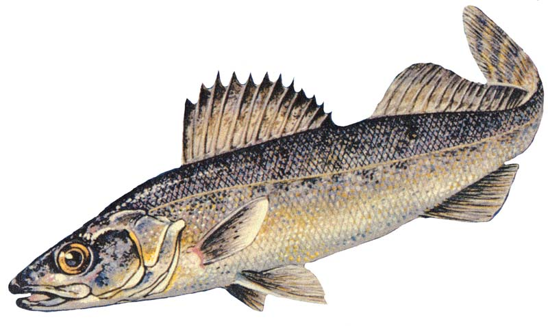

> 🐟

[macro](https://github.com/shkschneider/macro) is a fork of the [micro](https://github.com/micro-editor/micro) editor.

> µ

**micro** is a terminal-based text editor that aims to be easy to use and intuitive, while also taking advantage of the capabilities of modern terminals. It comes as a single, batteries-included, static binary with no dependencies; you can download and use it right now!

You can also check out the website for Micro at https://micro-editor.github.io.

## Build

```sh
go build -trimpath -ldflags "-s -w" -o macro ./cmd/macro
cp ./macro /usr/local/bin/
```

## Modifications

...

## Documentation

- [help]( https://github.com/micro-editor/micro/tree/master/runtime/help/help.md)
- [keybinds]( https://github.com/micro-editor/micro/tree/master/runtime/help/keybindings.md)
- [commands]( https://github.com/micro-editor/micro/tree/master/runtime/help/commands.md)
- [colors]( https://github.com/micro-editor/micro/tree/master/runtime/help/colors.md)
- [options]( https://github.com/micro-editor/micro/tree/master/runtime/help/options.md)
- [plugins]( https://github.com/micro-editor/micro/tree/master/runtime/help/plugins.md)

## Contributing

Please dont report bugs upstream as those might be mine!

## Thanks

- [zyedidia](https://github.com/zyedidia) for [micro](https://github.com/zyedidia/micro)
- [gdamore](https://github.com/gdamore) for [tcell](https://github.com/gdamore/tcell)
